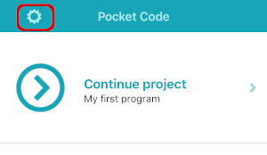
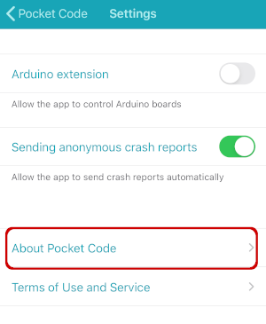
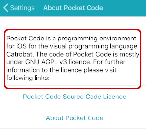

# Testing Pocket Code for iOS

## Produce a crash report

To produce a deterministic and reproducable crash report which will show up in Firebase Crashlytics, follow the following steps:

1. Go to *Settings*

2. Click on *About Pocket Code*

2. Tap on the description *four times* quickly after each other

