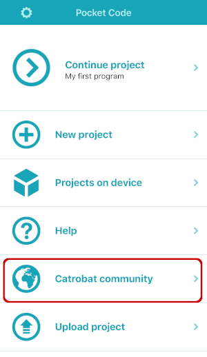
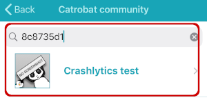

# Testing Pocket Code for iOS

## Produce a crash report

To produce a deterministic and reproducable crash report which will show up in Firebase Crashlytics, follow the following steps:

1. Go to *Settings*

2. Click on *About Pocket Code*

2. Tap on the description *four times* quickly after each other

## Produce a non-fatal crash report

To produce a deterministic and reproducable non-fatal crash report which will show up in Firebase Crashlytics, follow the following steps:

1. Go to *Catrobat community*

2. Search for the project with id **8c8735d1** and named **Crashlytics test**

3. Download and try to open this project. Opening the project will fail and result in a non-fatal report sent to Crashlytics
