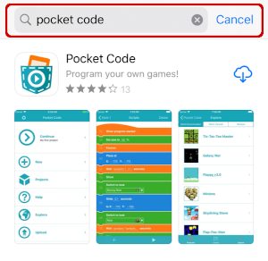
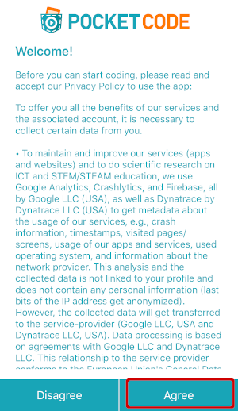

# Pocket Code for iOS
The Pocket Code app is available at the App Store (https://apps.apple.com/us/app/pocket-code/id1117935892) and can be downloaded directly from an iPhone running iOS 9.0 or higher.

## Installation instruction

- Open the *App Store* on your iPhone and click on *Search*:

- In the search bar enter **Pocket Code**

- Install and open the app

- Accept *Pocket Code*'s Privacy Policy

## Limitations
Pocket Code for iOS is still in development and does not ship with all the features the Android version has. Since it does not support the same *Catrobat Language Version* (the programming language *Pocket Code* is using), projects created on Android phones might not be visible on the *Catrobat community* screen on iOS. However, all projects created with *Pocket Code for iOS* will be available on *Pocket Code for Android*.

## How to use Pocket Code
A quick 60 second guide is available at https://www.catrobat.org/intro/ (press next to continue the instructions). 
The Catrobat project provides various guides to help people learn how to use the app https://share.catrob.at/pocketcode/help

# Testing Pocket Code for iOS

[Click here](./pocket-code-for-ios-testing.md) to find out details on how to use *Pocket Code* for this workshop.
